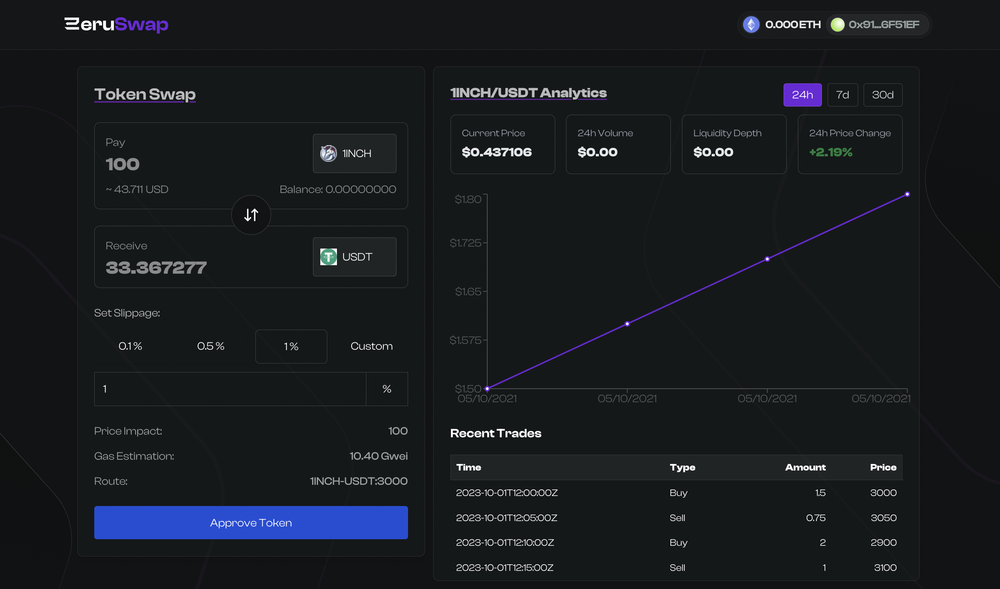

# Zeruswap



Zeruswap is a decentralized exchange (DEX) built on the Ethereum blockchain, allowing users to swap tokens seamlessly and securely. This project aims to provide a user-friendly interface and efficient trading experience. Zeruswap is built using the Uniswap V3 SDK, leveraging its powerful features for optimal trading performance.

## Getting Started

To get started with Zeruswap, follow these steps:

### Prerequisites

Make sure you have the following installed:

- Node.js (version 14 or higher)
- Yarn

### Installation

1. Clone the repository:

   ```bash
   git clone https://github.com/chiragbadhe/zeruswap.git
   cd zeruswap
   ```

2. Install the dependencies:

```bash
  yarn install
```

### Running the project

```bash
  yarn dev
```
